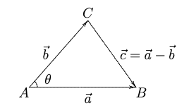
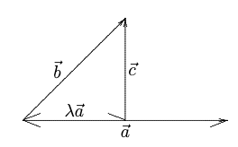

# 柯西—施瓦茨不等式

《机器学习数学基础》153 页，针对图 3-4-3，提出了一个问题：“点 $$A$$ 到 $$\mathbb{W}$$ 上的一个点的距离有无穷多个。现在，我们最关心的是其中最短的那个，怎么找？请参阅 3.6 节。”并且，在 3.6 节，使用最小二乘法，找到了点 $$A$$ 为终点的向量在 $$\mathbb{W}$$ 上的投影向量，那么这两个向量的距离就是“最短的那个”。

对于此结论，是否可以证明？

本文中将在介绍柯西—施瓦茨不等式的基础上，证明此上述结论。

柯西-施瓦茨不等式（Cauchy–Schwarz inequality），又称施瓦茨不等式或柯西-布尼亚科夫斯基-施瓦茨不等式（Cauchy–Bunyakovsky–Schwarz inequality）不等式，是以奧古斯丁·路易·柯西（Augustin Louis Cauchy），赫尔曼·阿曼杜斯·施瓦茨（Hermann Amandus Schwarz）和维克托·雅科夫列维奇·布尼亚科夫斯基（Виктор Яковлевич Буняковский）来命名的$$^{[1]}$$。 

## 1. 不等式

### 1.1 定理 1

已知 $$a_1,\cdots,a_n,b_1,\cdots,b_n$$ 为实数，则：

$$
\left(\sum_{i=1}^na_ib_i\right)^2\le\left(\sum_{i=1}^na_i^2\right)\left(\sum_{i=1}^nb_i^2\right) \tag{1.1}
$$

等式成立的成分必要条件是 $$a_i=\lambda b_i,(i=1,\cdots,n)$$ 。

这是比较常见的柯西不等式形式。

### 1.2 定理 2

已知 $$a_1,\cdots,a_n,b_1,\cdots,b_n$$ 为复数，则：

$$
\left|\sum_{i=1}^na_ib_i\right|^2\le\left(\sum_{i=1}^n|a_i|^2\right)\left(\sum_{i=1}^n|b_i|^2\right) \tag{1.2}
$$

等式成立的成分必要条件是 $$a_i=\lambda b_i,(i=1,\cdots,n)$$ ，$$\lambda$$ 为一复数。

若令 $$\pmb{a}=\begin{bmatrix}a_1&\cdots&a_n\end{bmatrix},\pmb{b}=\begin{bmatrix}b_1&\cdots&b_n\end{bmatrix}$$ ，则柯西不等式可表示为：

$$
|\pmb{a}\cdot\pmb{b}|\le\begin{Vmatrix}\pmb{a}\end{Vmatrix}\begin{Vmatrix}\pmb{b}\end{Vmatrix}\tag{1.3}
$$

### 1.3 定理 3

已知 $$\pmb{A}=(a_{ij})$$ 是正定对称矩阵，$$x_1,\cdots,x_n;y_1,\cdots,y_n$$ 为任意实数（或复数），则：

$$
\left|\sum_{i,j=1}^na_{ij}x_iy_j\right|\le\sqrt{\sum_{i,j=1}^na_{ij}x_ix_j}\sqrt{\sum_{i,j=1}^na_{ij}y_iy_j}\tag{1.4}
$$

对（1.4）式，可以用向量表示：

- $$\pmb{\zeta}\cdot\pmb{\eta}=\pmb{xAy}=\sum_{i,j=1}^na_{ij}x_iy_j$$
- $$\begin{Vmatrix}\zeta\end{Vmatrix}^2=\pmb{\zeta\cdot\zeta}=\pmb{xAx}^T=\sum_{i,j=1}^na_{ij}x_ix_j$$
- $$\begin{Vmatrix}\eta\end{Vmatrix}^2=\pmb{\eta\cdot\eta}=\pmb{yAy}^T=\sum_{i,j=1}^na_{ij}y_iy_j$$

### 1.4 定理 4

已知 $$a_i,b_i\in\mathbb{C}$$ ，则：

$$
|\sum_{i,j=1}^{\infty}a_ib_j|\le\left(\sum_{i=1}^{\infty}|a_i|^2\right)^{\frac{1}{2}}\left(\sum_{i=1}^{\infty}|b_i|^2\right)^{\frac{1}{2}} \tag{1.5}
$$

等式成立的充分必要条件是 $$a_i=\lambda b_i,(i=1,\cdots,\lambda\in\mathbb{C})$$ 。

将定理 4 推广到积分形式，即为**柯西—施瓦茨不等式**。

### 1.5 定理 5

已知 $$f,g$$ 是区间 $$[a,b]$$ 上的连续函数，$$f,g\in\mathbb{C}[a,b]$$ ，则：

$$
\begin{vmatrix}\int_a^bf(x)g(x)dx\end{vmatrix}\le\int_a^b|f(x)|^2dx\int_a^b|g(x)|^2dx\tag{1.7}
$$

（1.7）式称为柯西-施瓦茨不等式（Cauchy–Schwarz inequality）、施瓦茨不等式或柯西-布尼亚科夫斯基-施瓦茨不等式（Cauchy–Bunyakovsky–Schwarz inequality）。此不等式是乌克兰数学家 Viktor Yakovlerich Bunyakovsky（1804-1889）与德国数学家（原籍波兰）KarlHerman Amandus Schwarz (1843-1921)，分别于1861年和1885年发现。虽然布尼亚克夫斯基比施瓦茨先发现了这个不等式，而在很多数学教材中，常常把他的名字忽略——恐怕不是因为他名字太长，更可能的原因是 19 世纪，数学研究的中心在德国、法国，不在这个中心的人所作出的发现，就很难引起重视。这种现象在当今也难免。

### 1.6 定理 6

已知 $$a_1,\cdots,a_n;b_1,\cdots,b_n$$ 为任意复数，且 $$p,q\ge1，\frac{1}{p}+\frac{1}{q}=1$$ ，则：

$$
|\sum_{i=1}^{n}a_ib_i|\le\left(\sum_{i=1}^{n}|a_i|^p\right)^{\frac{1}{p}}\left(\sum_{i=1}^{n}|b_i|^q\right)^{\frac{1}{q}} \tag{1.9}
$$

（1.9）式称为**赫尔德不等式** （H ̈older不等式），如果推广到积分形式，就是下面的定理7。

### 1.7 定理 7

已知 $$f,g\in\mathbb{C}[a,b]，p,q\ge1，\frac{1}{p}+\frac{1}{q}=1$$ ，则：

$$
\begin{vmatrix}\int_a^bf(x)g(x)dx\end{vmatrix}\le\left(\int_a^b|f(x)|^pdx\right)^{\frac{1}{p}}\left(\int_a^b|g(x)|^qdx\right)^{\frac{1}{q}}\tag{1.10}
$$

还可以写成更一般的形式，定理8所示。

### 1.8 定理 8

已知 $$f_1,\cdots,f_n\in\mathbb{C}[a,b]$$ ，且 $$\frac{1}{p_1}+\frac{1}{p_2}+\cdots+\frac{1}{p_n}=1,p_i\ge1$$ ，则：

$$
\begin{vmatrix}\int_a^bf_1(x)f_2(x)\cdots f_n(x)dx\end{vmatrix}\le\left(\int_a^b|f_1(x)|^{p_1}dx\right)^{\frac{1}{p_1}}\cdots\left(\int_a^b|f_n(x)|^{p_n}dx\right)^{\frac{1}{p_n}}\tag{1.11}
$$

德国数学家赫尔德（Otto  Lud-wig  H ̈older  (1859-1937)）在1885年研究傅里叶技术收敛性问题时，发现了上述不等式。

赫尔德不等式，也称为赫尔德—里斯不等式（H ̈older-Riesz）。

当 $$p=q=2$$ ，赫尔德不等式就退化为柯西—施瓦茨不等式。

## 2. 余弦定理

对柯西—施瓦茨不等式的最直接理解，可以通过余弦定理，如图所示：

由余弦定理，得：

$$
|\pmb{a}|^2+|\pmb{b}|^2-|\pmb{a}-\pmb{b}|^2=2|\pmb{a}||\pmb{b}|\cos\theta \tag{2.1}
$$

所以：$$\pmb{a}\cdot\pmb{b}=|\pmb{a}||\pmb{b}|\cos\theta$$

因为：$$|\cos\theta|\le1$$ ，可得：

$$
|\pmb{a}\cdot\pmb{b}|\le|\pmb{a}||\pmb{b}|\tag{2.2}
$$

亦即得到了（1.3）式。

## 3. 柯西—施瓦茨不等式的证明

### 3.1 判别式

这是一种最常见的证明方法。

向量 $$\pmb{a},\pmb{b}$$ 不平行，所以：$$\pmb{c}=\pmb{b}-\lambda\pmb{a},\lambda\in\mathbb{R}$$ 。

计算 $$\pmb{c}$$ 的长度：

$$
\begin{split}|\pmb{c}|^2&=\pmb{c\cdot c}=(\pmb{b}-\lambda\pmb{a})\cdot(\pmb{b}-\lambda\pmb{a})\\&=\pmb{b\cdot b}-2\pmb{a\cdot b}\lambda+\pmb{a\cdot a}\lambda^2\\&=|\pmb{a}|^2\lambda^2-2\pmb{a}\cdot\pmb{b}\lambda+|\pmb{b}|^2\end{split} \tag{3.1}
$$

将（3.1）式视为 $$\lambda$$ 的一元二次方程。由于 $$|\pmb{c}|^2\ge0$$ ，且 $$|\pmb{a}|^2\ge0$$ 。所以（3.1）式中的二次函数是开口向上的抛物线，且与横轴无交点（$$|\pmb{c}|^2=0$$ 是极限），即 $$\lambda$$ 没有实根，所以判别式小于等于 $$0$$ 。

$$
\Delta=(2\pmb{a\cdot b})^2-4|\pmb{a}|^2|\pmb{b}|^2\le0
$$

所以：$$|\pmb{a}\cdot\pmb{b}|\le|\pmb{a}||\pmb{b}|$$

### 3.2 投影——最短距离

前述证明中，避免了余弦定理中的角度，使用了向量的点积，对任意维的向量都适用。

由前述假设，可得 $$\lambda$$ ：

$$
\lambda=\frac{\pmb{a\cdot b}}{|\pmb{a}|^2}, \quad\pmb{c}=\pmb{b}-\lambda\pmb{a}=\pmb{b}-\frac{\pmb{a\cdot b}}{|\pmb{a}|^2}\pmb{a} \tag{3.2}
$$

将（3.2）式代入到（3.1）式，则：

$$
0\le|\pmb{c}|^2=|\pmb{a}|^2\left(\frac{\pmb{a\cdot b}}{|\pmb{a}|^2}\right)^2-2\pmb{a\cdot b}\left(\frac{\pmb{a\cdot b}}{|\pmb{a}|^2}\right)+|\pmb{b}|^2 \tag{3.3}
$$

整理得：$$(\pmb{a\cdot b})^2\le|\pmb{a}|^2|\pmb{b}|^2$$

即得到（1.3）式。

如何理解（3.2）式中的 $$\lambda$$ ？

$$
\pmb{a\cdot c} = \pmb{a}\cdot(\pmb{b}-\lambda\pmb{a})=\pmb{a\cdot b}-\lambda|\pmb{a}|^2
$$

因此，可以有如下关系：

$$
\pmb{a\cdot c}=0\quad\Longleftrightarrow\quad \pmb{a}\bot\pmb{c} \quad\Longleftrightarrow\quad \lambda=\frac{\pmb{a\cdot b}}{|\pmb{a}|^2}
$$

由此可知，$$\lambda$$ 的选择，恰好是能够让 $$\lambda\pmb{a}$$ 是 $$\pmb{b}$$ 在 $$\pmb{a}$$ 上的投影，$$|\pmb{c}|$$ 则是 $$\pmb{b}$$ 至 $$\pmb{a}$$ 的最短距离。其关系如下图所示：

$$\lambda$$ 还称为拉格朗日乘子（Largrange multiplier）。

## 参考文献

[1]. [Wikipedia: Cauchy-Schwarz inequality](https://en.wikipedia.org/wiki/Cauchy%E2%80%93Schwarz_inequality)

[2]. 齐伟. 机器学习数学基础[M]. 北京：电子工业出版社，2023. 
