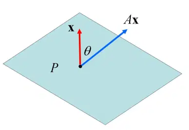

# 正定矩阵

## 定义

令 $$\pmb{A}$$ 为一个 $$n\times n$$ 实对称矩阵，当且仅当对所有 $$n$$ 维非零向量 $$\pmb{x}$$ ，都有：

$$
\pmb{x}^{\rm{T}}\pmb{Ax}\gt0
$$
则称 $$\pmb{A}$$ 为**正定**（positive definite）；若上述条件为：

$$
\pmb{x}^{\rm{T}}\pmb{Ax}\ge0
$$
则称 $$\pmb{A}$$ 为**半正定**（positive semidefinite）.

### 分析

在上述关于正定矩阵的定义中，之所以强调 $$\pmb{A}$$ 是实对称矩阵，是因为任何一个实数方阵，都可以表示为一个实对称矩阵与一个反对称矩阵的和，即 $$\pmb{A}=\pmb{B}+\pmb{C}$$ （称为**卡氏分解**），其中：

$$
\begin{split}\pmb{B}=\frac{1}{2}(\pmb{A}+\pmb{A}^{\rm{T}})\\\pmb{C}=\frac{1}{2}(\pmb{A}-\pmb{A}^{\rm{T}}) \end{split}
$$
计算可验证：$$\pmb{B}=\pmb{B}^{\rm{T}}$$ 、$$\pmb{C}=-\pmb{C}^{\rm{T}}$$ 。所以，$$\pmb{B}$$ 是对称矩阵，$$\pmb{C}$$ 是反对称矩阵（反对称矩阵，也称为“斜对称矩阵”$$^{[2]}$$）。

考虑：

$$
\pmb{x}^{\rm{T}}\pmb{Ax}=\pmb{x}^{\rm{T}}(\pmb{B}+\pmb{C})\pmb{x}=\pmb{x}^{\rm{T}}\pmb{Bx}+\pmb{x}^{\rm{T}}\pmb{Cx}
$$
因为：

$$
\pmb{x}^{\rm{T}}\pmb{Cx}=(\pmb{x}^{\rm{T}}\pmb{Cx})^{\rm{T}}=\pmb{x}^{\rm{T}}\pmb{C}^{\rm{T}}\pmb{x}=-\pmb{x}^{\rm{T}}\pmb{Cx}
$$
故 $$\pmb{x}^{\rm{T}}\pmb{Cx} = 0$$ ，因此

$$
\pmb{x}^{\rm{T}}\pmb{Ax}=\pmb{x}^{\rm{T}}\pmb{Bx}
$$
即二次型 $$\pmb{x}^{\rm{T}}\pmb{Ax}$$ 可用对称部分表示。

### 几何意义

- 若 $$n=1$$ ，则矩阵 $$\pmb{A}$$ 和向量 $$\pmb{x}$$ 都退化为标量 $$a、x$$ ，对任意非零的 $$x$$ ，有：$$xax=ax^2\gt0$$ 。

  显然 $$a$$ 是正数，完整地说，$$a$$ 是正定的。

- 若 $$n\gt1$$ ，$$\pmb{Ax}$$ 与 $$\pmb{x}$$ 之间的夹角 $$\theta$$ 的余弦为 $$\cos\theta = \frac{\pmb{x}^{\rm{T}}(\pmb{Ax})}{\begin{Vmatrix}\pmb{x}\end{Vmatrix}\begin{Vmatrix}\pmb{Ax}\end{Vmatrix}}$$ 。

  $$\pmb{Ax}$$ 与 $$\pmb{x}$$ 点积为正值，则 $$\theta \lt 90°$$ ，如下图所示，$$\pmb{x}$$ 为超平面 $$P$$ 的法向量，正定矩阵 $$\pmb{A}$$ 保证变换后的向量 $$\pmb{Ax}$$ 与原向量 $$\pmb{x}$$ 都位于超平面 $$P$$ 的同一侧。

  

对称正定矩阵的对角化形式 $$\pmb{A}=\pmb{Q\Lambda Q}^{\rm{-1}}$$ 的几何解释：

- $$\pmb{A}\sim\pmb{\Lambda}$$ ，$$\pmb{A}$$ 参考有序基 $$\{\pmb{q}_1,\cdots,\pmb{q}_n\}$$ 的变换矩阵即为对角矩阵 $$\pmb{\Lambda}$$ 。由于每个主对角元素都大于零，对称正定矩阵具有分别拉伸各主轴（即特征向量方向）的功能，而伸缩量即为特征值。
- 还可以认为连续执行了三个线性变换：
  1. $$\pmb{Q}^{-1}$$ ：旋转变换
  2. $$\pmb{\Lambda}$$：拉伸变换
  3. $$\pmb{Q}$$ ：逆旋转变换

## 定理

若 $$\pmb{A}$$ 是一个实对称正定矩阵，则 $$\pmb{A}$$ 的特征值皆为正，反之亦然。

**证明**

（1）$$\pmb{A}$$ 是实对称正定矩阵，令 $$\pmb{A}=\pmb{Q\Lambda Q}^{\rm{T}}$$ ，其中 $$\pmb{\Lambda} = \rm{diag}(\lambda_1,\cdots,\lambda_n)$$ ，$$\lambda_i$$ 是 $$\pmb{A}$$ 的特征值。

设 $$\pmb{Q}=\begin{bmatrix}\pmb{q}_1&\cdots&\pmb{q}_n\end{bmatrix}$$ 的所有列都是单范正交特征向量。

因为 $$\pmb{A}$$ 正定，所以：

$$
\pmb{q}_i^{\rm{T}}\pmb{Aq}_i=\pmb{q}_i^{\rm{T}}(\lambda_i\pmb{q}_i)=\lambda_i(\pmb{q}_i^{\rm{T}}\pmb{q}_i)=\lambda_i\gt0
$$
（2）设 $$\lambda_i\gt0,(i=1,\cdots,n)$$ 。令 $$\pmb{y}=\pmb{Q}^{\rm{T}}\pmb{x}=\pmb{Q}^{-1}\pmb{x}$$ 。因为 $$\pmb{x} = \pmb{Qy}$$ ，$$\pmb{y}$$ 必定为非零向量，则：

$$
\pmb{x}^{\rm{T}}\pmb{Ax}=\pmb{x}^{\rm{T}}\pmb{Q\Lambda Q}^{\rm{T}}\pmb{x}=\pmb{y}^{\rm{T}}\pmb{\Lambda y}=\lambda_1y_1^2+\cdots+\lambda_ny_n^2\gt0
$$

## 性质

- **性质1：正定矩阵的每一个主子阵都是正定的**

**证明**

为了证明此性质，首先引入一种符号记法。

令 $$S$$ 为 $$\{1,2,\cdots,n \}$$ 的子集，$$S^{\rm{c}}$$ 表示 $$S$$ 的补集，$$|S|$$ 表示集合 $$S$$ 的元素数，称为基数（cardinal number）。对于所有 $$i\in S^{\rm{c}}$$ ，将 $$n\times n$$ 阶矩阵 $$\pmb{A}$$ 的第 $$i$$ 行与第 $$i$$ 列同时删除，可得到一个 $$|S|\times |S|$$ 阶主子阵（principal submatrix），以 $$\pmb{A}_S$$ 表示。例如：

$$
\pmb{A}=\begin{bmatrix}5&-1&3&-1\\-1&2&-2&-1\\3&-2&3&1\\-1&-1&1&6\end{bmatrix}
$$
下面几个都是主子阵：

$$
\pmb{A}_{\{1,3,4\}}=\begin{bmatrix}5&3&-1\\3&3&1\\-1&1&6\end{bmatrix},\quad \pmb{A}_{\{2,4\}}=\begin{bmatrix}2&-1\\-1&6\end{bmatrix}\quad\pmb{A}_{\{3\}}=\begin{bmatrix}3\end{bmatrix}
$$
对于向量 $$\pmb{x}\in\mathbb{R}^n$$ ，用 $$\pmb{x}_{S}$$ 表示删除了 $$S$$ 的补集元素后得到的向量，显然 $$\pmb{x}_S$$ 是 $$|S|$$ 维向量。

对于任何 $$k\in S^{\rm{c}}$$ ，令 $$\pmb{x}$$ 的第 $$k$$ 个元为零，则：

$$
\pmb{x}_S^{\rm{T}}\pmb{A}_S\pmb{x}_S=\pmb{x}^{\rm{T}}\pmb{Ax}\gt0
$$
由于 $$\pmb{x}_S\ne0$$ 是任意的，所以 $$\pmb{A}_S$$ 是正定的。

- **性质2：正定矩阵的特征值皆为正数**

**证明**

设 $$\lambda$$ 为正定矩阵 $$\pmb{A}$$ 的一个特征值，对于特征向量 $$\pmb{x}\ne0$$ ，则：

$$
\pmb{x}^{\rm{T}}\pmb{Ax}=\pmb{x}^{\rm{T}}\lambda\pmb{x}=\lambda\pmb{x}^{\rm{T}}\pmb{x}
$$
则：$$\lambda=\frac{\pmb{x}^{\rm{T}}\pmb{Ax}}{\pmb{x}^{\rm{T}}\pmb{x}}$$ ，分子分母都是正数，故 $$\lambda\gt0$$ 。

**拓展**

由性质2可知：设 $$\lambda_i\gt0$$  是正定矩阵 $$\pmb{A}$$ 的特征值，则 $$\pmb{A}$$ 可逆， $$\pmb{A}^{-1}$$ 和 $$\pmb{A}^{\rm{T}}$$ 也是正定矩阵，且：

$$
\begin{split}\rm{det}\pmb{A}&=\lambda_1\lambda_2\cdots\lambda_n\gt0\\\rm{trace}\pmb{A}&=\lambda_1+\lambda_2+\cdots+\lambda_n\gt0\end{split}
$$
结合性质1，每个主子阵 $$\pmb{A}_S$$ 亦有类似性质。

- 性质3：正定矩阵的主元（pivot）都是正数
- 性质4：正定矩阵 $$\pmb{A}$$ 可以表示为 $$\pmb{A}=\pmb{B}^{\rm{T}}\pmb{B}$$ ，$$\pmb{B}$$ 是一个可逆矩阵

## 判别

- 若 $$n\times n$$ 矩阵 $$\pmb{A}$$ 的特征值都是正数，则 $$\pmb{A}$$ 是正定矩阵
- 若 $$n\times n$$ 矩阵 $$\pmb{A}$$ 的轴（主元）都是正数，则 $$\pmb{A}$$ 是正定矩阵 
- 若 $$n\times n$$ 矩阵 $$\pmb{A}$$ 的领先主子阵的行列式都是正数，则 $$\pmb{A}$$ 是正定矩阵
- 若 $$n\times n$$ 矩阵 $$\pmb{A}$$ 可表示为 $$\pmb{A}=\pmb{B}^{\rm{T}}\pmb{B}$$ ，$$\pmb{B}$$ 是一个可逆矩阵，则 $$\pmb{A}$$ 是正定矩阵

## 参考文献

[1]. [特殊矩阵-六：正定矩阵](https://ccjou.wordpress.com/2009/10/01/%e7%89%b9%e6%ae%8a%e7%9f%a9%e9%99%a3-%e5%85%ad%ef%bc%9a%e6%ad%a3%e5%ae%9a%e7%9f%a9%e9%99%a3/)

[2]. 反对称矩阵：指满足 $$\pmb{A}^{\text{T}}=-\pmb{A}$$ 的矩阵，或者，对于矩阵 $$\pmb{A}=(a_{ij})$$ ，各元素的关系为 $$a_{ij}=-a{ji}$$ ，例如下面的矩阵就是一个反对称矩阵：
$$
\begin{bmatrix}0&2&-1\\-2&0&-4\\1&4&0\end{bmatrix}
$$
反对称矩阵特性：

- 反对称矩阵自身相乘的积是对称矩阵
- 对任意矩阵 $$\pmb{A}$$ ，$$\pmb{A}^{\text{T}}-\pmb{A}$$ 是反对称矩阵
- 若 $$\pmb{A}$$ 是反对称矩阵，$$\pmb{x}$$ 是向量，则 $$\pmb{x}^{\text{T}}\pmb{Ax}=0$$
- 反对称矩阵的主对角线匀速必是零，所以其迹为零